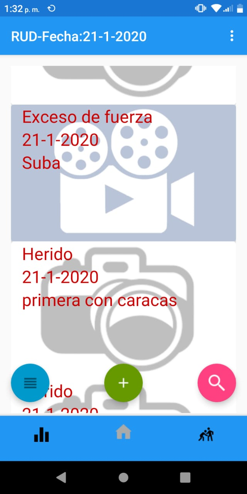

# categorize_evidence_MVP_androidApp

This code is from an android application, with this application you can sort evidence pictures and videos out, based on main categorices that Colombian lawyers use to report humman rights violations at strikes. This app was developed in android studio with Java lengauge, MVP architecture and FireStore conexion.

## Getting started

This app is connected with Firebase thus you must create a new database and change this conexion, busides you should create a new user and password to be able sign in the firebase auth, as you can see in the image there's not option to create new user from the app so you should create it from firebase console.

## Running the project

You should be careful with gradle files because it's very probable when you download this project there would be new versions of libraries. 

When you achieve to run the app you will see the home view, in this view you can create a folder with the plus button where you can describe the place, date and context of the folder you want create, if you had created any folder before you can see in the home page.

From this view you can open the folder when you click at search button and you click the resepective date.

Then you will see all files in the folder that you selected, in this view you can select the file to see the description for this evidence, busside you can watch the video or photo that support this evidence. 

If you want to upload any photo or video you have to open the respective file and use the option of share then you will be able to select the option to share with this application

Finally the most important feacture for this app is that you can observe the statitics information from every evidence that you were upload, this option is in navigation menu the left item, you will something like this.

